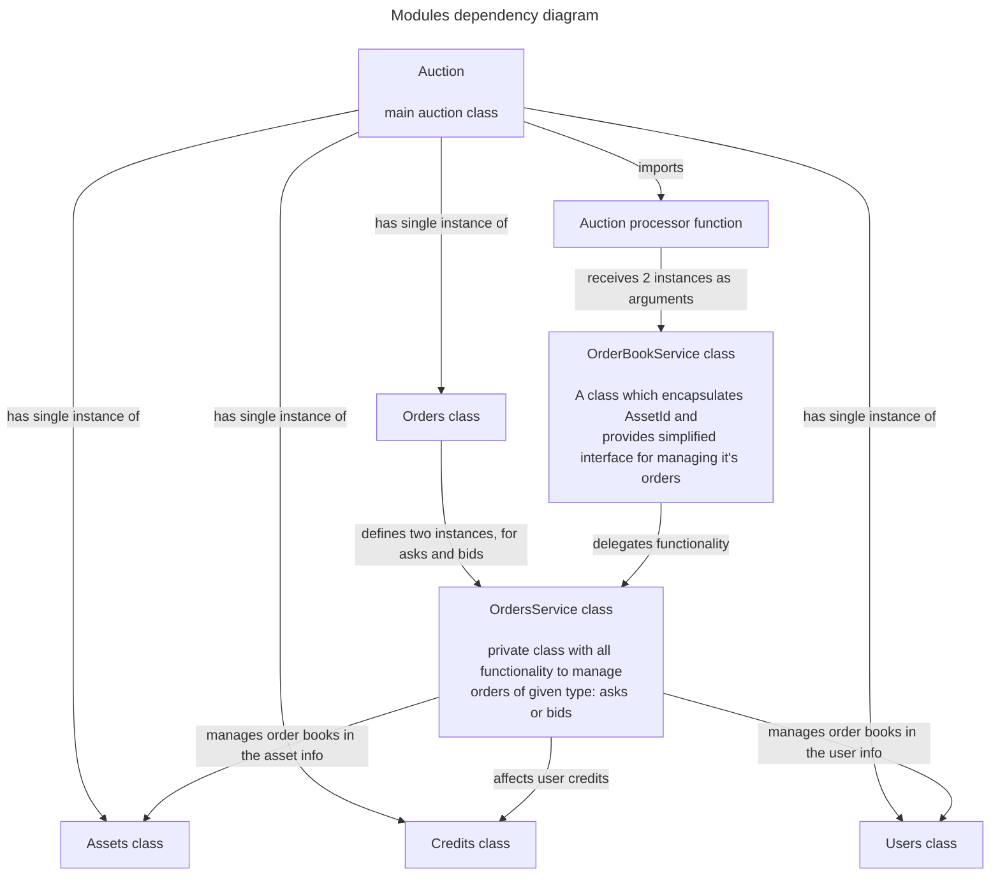

# Auction for Motoko

## Overview

A module which implements auction functionality for various trading pairs against quote fungible token.

### Links

### Motivation

### Interface

`Auction` has class-based implementation.

Stable data should be declared as
```motoko
stable var auctionDataV2 : Auction.StableDataV2 = Auction.defaultStableDataV2();
```

In `preupgrade` and `postupgrade` hooks top-level app should run `auctionDataV2 := auction.share();` and `auction.unshare(auctionDataV2);` respectively

Note: `V2` stands for second version of stable data. If you already use older stable data type, you should declare new one like this to save your data:
```motoko
stable var auctionDataV2 : Auction.StableDataV2 = Auction.migrateStableDataV2(auctionDataV1);
```

## Usage

### Example

```motoko
import Principal "mo:base/Principal";
import Auction "./auction";
import Vec "mo:vector";

let a = Auction.Auction(
  // quote asset id
  0,
  {
     minAskVolume = func (_) = 0;
     minimumOrder = 0;
     performanceCounter = func (_) = 0;
   }
 );
// register two assets: 0th is the quote asset
a.registerAssets(2);

// register buyer. This user will spend quote asset to buy asset 1
let buyer = Principal.fromText("khppa-evswo-bmx2f-4o7bj-4t6ai-burgf-ued7b-vpduu-6fgxt-ajby6-iae");
ignore a.appendCredit(buyer, 0, 1_000);

// register seller. This user has asset 1 and sells it 
let seller = Principal.fromText("ocqy6-3dphi-xgf54-vkr2e-lk4oz-3exc6-446gr-5e72g-bsdfo-4nzrm-hqe");
ignore a.appendCredit(seller, 1, 1_000);

// buyer wants to buy 10 assets with max price 50
ignore a.placeOrder(buyer, #bid, 1, 10, 50.0);
// seller wants to sell 10 assets with min price 10
ignore a.placeOrder(seller, #ask, 1, 10, 10.0);

// process trading pair 0<->1
a.processAsset(1);

// check user credits, deal price was 30 (an average)
assert a.getCredit(buyer, 0) == { total = 700; locked = 0; avaliable = 700 }; // spent 300;
assert a.getCredit(buyer, 1) == { total = 10; locked = 0; avaliable = 10 }; // bought 10;

assert a.getCredit(seller, 0) == { total = 300; locked = 0; avaliable = 300 }; // gained 300;
assert a.getCredit(seller, 1) == { total = 990; locked = 0; avaliable = 990 }; // sold 10;
```

[Executable version of above example](https://embed.motoko.org/motoko/g/3iXE51p6Wej8KA2Ejkw8b4DpYt8oveQ7JvWdMdDEa5AE6UKLYEZBR4Hr8SEo7Cx9tDTxN7NHrFy83Ems8Z8JKziGZ72rpPQjrt95YDUncMhcjA7rm1148wGXqcTZnpBmuTLq35beebZb5dDEkpXngsipyqFMu9UsQhdFxhaKrqrmxjEQoVYq3zAwBDFWyMfVADbmqMvWoJo4j23yXM58nKU6qB8Gh7VaEQqU58aWdS4oEyzCoZ8ZrbBE2m6JDgaYftNTkY7EbbPGP1ykExiKFmoCqYizpj9RgWRP73vm6DsHzyXbdzz6DYwxaHSA1zBEzt3MLALQjG774MbPENg1Ep6uSMiUedDoEu6QXsboS2W4wiZhSor4Ei4JqmF3M3zPe1zL7rXH4FNj6tTBHrwJYocbLD4AYawAZ8PdhN4oKUVACCFTgKoXZrbQBpN8LLnnszo1zYsBbMcszoAhQ8icgqQ7VpvNMitUnVeXSJs656enEeyQD2MXi1voos7nFwASM7vPqrkk9WBqpeF31CZD3LRcfe2DRdYV6bS7g99nEA3aCExdZpxtBdSTtKn7dmHZJkZEfhGR6HpvWgyBN2iujnweJEB6R4164VLrfogk7kk7KiSX8B9137N2grvmgUqamKUWyBr2sHHNzDAf6UNHJMe3YGyZ5CLA3seqo3z92niGPvBLTQhTeqHDKKeCxjV9xF3iyWKPHV6PSiRsAGDYTcziDSNK39YjvxSrNdjce4Z8NzY9FhS9ejZSJmfLkyYKCY7xr6LUuuG7AqKsDdrhj6cxwtuSK5qjqSDy4a9Qkdy3ZhcmJRFMheRwdxVDSeGKyG37BZfxfZSYPKhTKwx55sTivQnPSZwmP6So1zDDerpgG97PBpW2BFNuibLT6jmhzL7nAhpc1A?lines=43)

### Build & test

Run:
```
mops test
```

### Benchmark

Run
```
mops bench --replica pocket-ic
```

## Design

## Implementation notes

Auction core consist of modules:

### Auction

Main module of the auction core. Caller app needs to import only this module

### Assets

Consists of class `Assets` with assets management functionality: encapsulates asset registry, provides 
interface for managing assets and asset orders. Does not have any dependencies

### Credits

Consists of class `Credits` with user credits registry, provides API to get, update, lock, unlock user credits. 
Does not have any dependencies

### Users

Consists of class `Users` with users management functionality: encapsulates users registry, provides
interface for managing users and user orders. Does not have any dependencies

### Orders

Module with functionality to manage orders. Contains 3 classes:

**Orders** (public)

Contains orders management functionality on higher level than `Assets` or `Users`, makes sure that any changes in 
orders are reflected properly in both `Assets` and `Users`. Contains all the logic to place/cancel orders and execute them.

Depends on: `Assets`, `Credits`, `Users`.

**OrdersService** (private)

Private class for internal usage: implements lower level functionality, related to orders management. `Orders` class
defines two instances of `OrdersService`: one for asks, second for bids. The goal of this class is to implement 
some kind of polymorphism and avoid code repetitions, since `ask` and `bid` orders are similar but have significant 
differences in expected logic when we place/cancel/execute them

Depends on: `Assets`, `Credits`, `Users`.

**OrderBookService** (public)

Class-shortcut, which encapsulates orders management logic of single type (ask or bid) of single asset id. Used 
for minimizing dependencies of caller code: auction processing functionality should not know about asset id-s

Depends on: `OrdersService` of given type.

### Auction processor function

A separate function which clears auction and executes all fulfilled orders

Depends on `OrderBookService`, provided in arguments




## Copyright

MR Research AG, 2023-2024
## Authors

Main author: Andy Gura
Contributors: Timo Hanke
## License 

Apache-2.0
